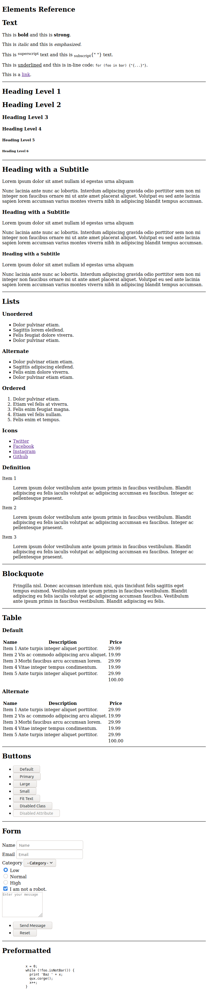
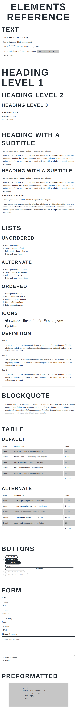

# HTML Elements Reference

A collection of HTML element references for design and development.

Essentially, this is the first "test page" for a site as I develop custom styles (CSS/SCSS). This is intended to set a basis for harmonizing styles (also called "style resets") across browsers for the elements typically used in HTML layouts.

Current sets:

- Plain HTML
- JSX React (Plain)
- JSX Gatsby (React based framework) with Layout

What this looks like:

No Styles (Browser Defaults):

With styles applied:

